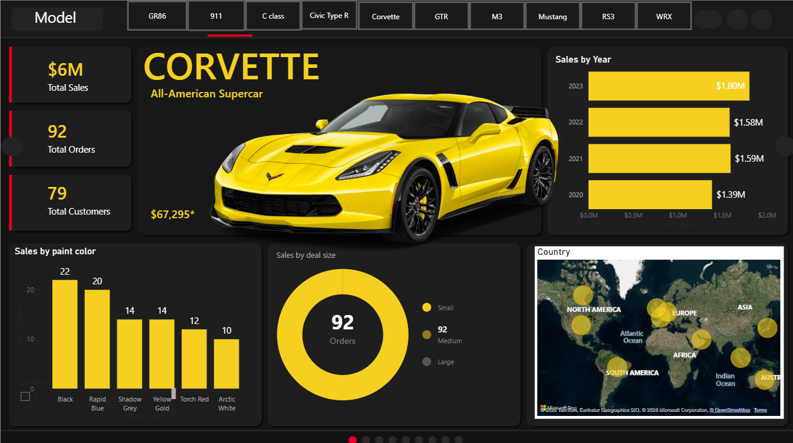
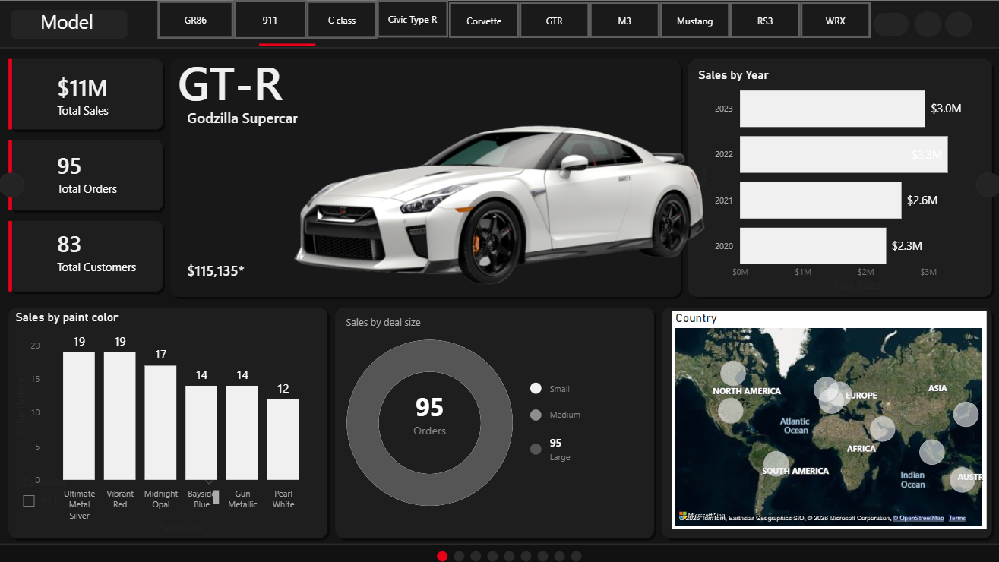
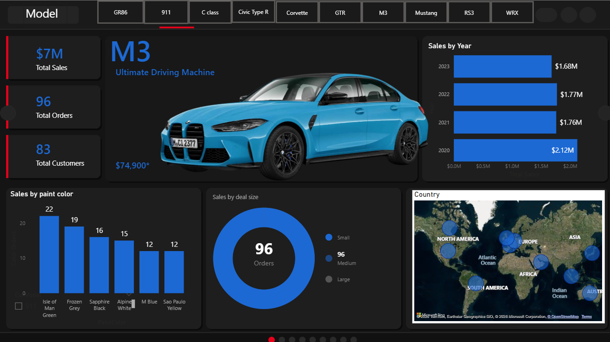
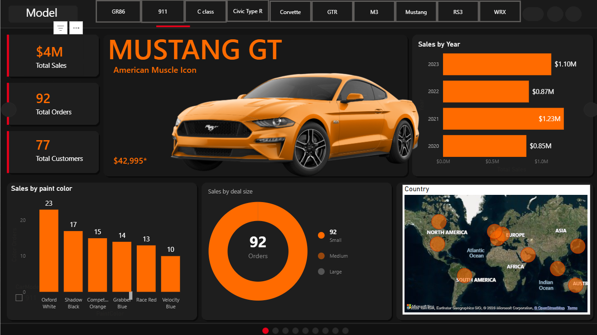
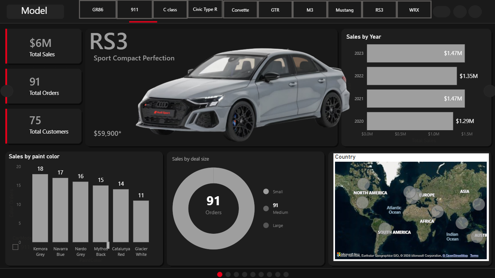
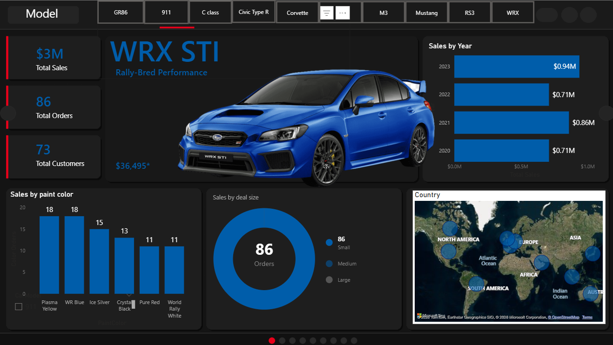
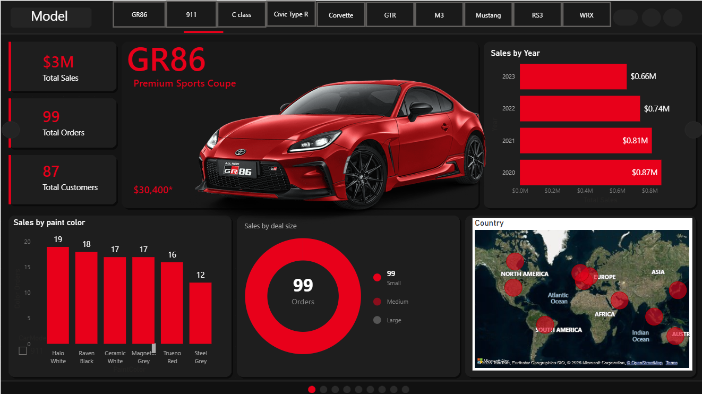

# 🚗 Power BI Car Sales Overview Dashboard

## 🚀 Overview
This project presents an interactive Power BI dashboard designed to analyze car sales performance across different models and categories.  
It provides insights into sales trends, product performance, and key business metrics to support data-driven decision-making.

---

## 🎯 Objectives
- Analyze sales performance by car model  
- Identify top-performing and underperforming vehicles  
- Track trends and patterns in automotive sales  
- Provide actionable insights for business growth  

---

## 📊 Key Features
- Model-wise sales analysis  
- Comparative performance (Corvette, GTR, M3, Mustang, etc.)  
- KPI tracking and visual storytelling  
- Interactive filters for dynamic exploration  
- Clean and intuitive dashboard design  

---

## ⚙️ Tech Stack
- Power BI  
- DAX (for calculations & KPIs)  
- Power Query (data transformation)  
- Data Modeling  

---

## 📸 Dashboard Preview

### Corvette

### GTR

### BMW M3

### Mustang

### Audi RS3

### Subaru WRX

### Toyota GR86

---

## 📂 Project Structure
